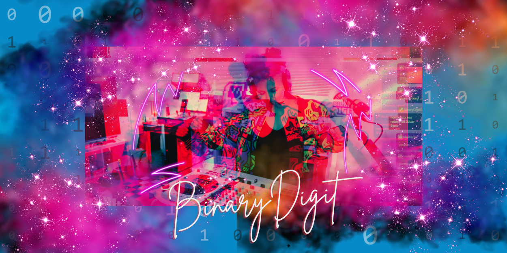

I’m B, a Xennial who grew up when the internet was young, just as I was. My family bought our first computer in 1997, and I become fascinated with how computers worked, how the web evolved, and being online a bit too much!

I'm originally from New York and currently living in Michigan. My work background is in tech (I was a systems engineer, part time web dev, and now a manager). I would love to find more diverse folks in gaming, tech, music and all things creative. I love to travel, take photos, game on my PC, PS5 and Switch, stream, tweak code and always learning something new. ✨

Welcome to my personal space to gather random thoughts, how-tos, and things I gather from the internet!

## Colophon

- This site is created with [Hugo](https://gohugo.io/) and [Blowfish](https://blowfish.page/), and hosted on [Netlify](https://netlify.com).

- The no AI and coffee powered buttons in the footer are created by [Andy Carolan](https://www.andycarolan.com/).

- Feature images are created with [Canva](https://canva.com/) and my own images.

- Header and favicon logos are created by [Flaticon](https://www.flaticon.com/).

- [Webmentions](https://www.w3.org/TR/webmention/) are used to collect "likes" but no comments are displayed.

- Comments powered by [Giscus](https://giscus.app).

- Contact form powered by [Letterbird](https://letterbird.co/).

- Current Webrings: [CSS JOY](https://cs.sjoy.lol/) and [Tinylytics](https://tinylytics.app/).

## Referrals

- Get 10% off your first year when you sign up for [Fastmail](https://ref.fm/u29983120).

- Get a fun webpage, Mastodon account, status log, weblog, email forwarding and more with [OMG.lol](https://home.omg.lol/referred-by/binarydigit).

## Contact Me

