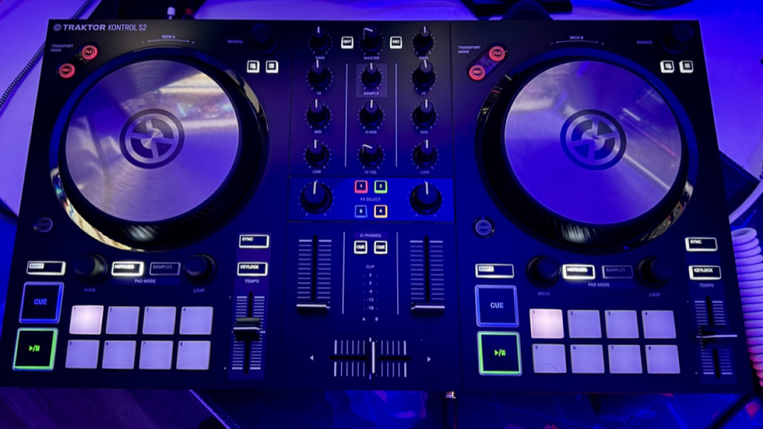

Traktor S2 Mk3

I've wanted to stream more on Twitch, but sometimes it's alot of effort to go downstairs to stand for hours and work with my lights and dual computer setup. It's also dark and cold, and more often than not I like sitting at my desk in the daylight and brightness with the pups in my room. 

Now that the weather is getting really nice, I'd love to start doing more streams outside in the backyard as well as the office. After doing some research I went with Native Instrument's Traktor Kontrol S2 Mark 3 board! It's 2 channels, awesome build quality, mic mute, and comes with Traktor Pro as well as DJ 2 so that I can use either "pro" or "regular" software already included! I love Virtual DJ (more than Recordbox) but would need to buy another license, and really like the layout of the Traktor software so I'll give it a try first.

It's amazing how it's half of the price of my "beginner" board (the DDJ-FLX6) and feels more awesome and compact. I'm learning that just because a brand is "industry standard" doesn't mean you need it for a hobby. I do like both so will practice on each. Next up will be to get some good studio monitors. 

_Post updated on June 6, 2024_