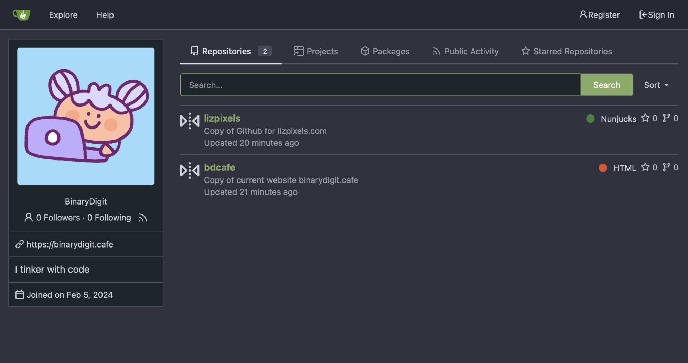

I saw the news that the co-founder of Github was banned via [Hacker News](https://news.ycombinator.com/item?id=39267200) - [tweet here](https://twitter.com/defunkt/status/1754610843361362360). Looks like it was taken care of pretty quickly, and is just a reminder than anyone using a third party service, no matter who you are, can get removed at any time, even if by mistake!

I had my original Instagram account banned with no warning and no explanation. Extremely frustrating. I couldn't get it back and support was abismal. I was sad about, but also was already on my way off that platform by deleting my images. I'm glad I didn't rely on that account for Twitch or keeping in touch with many folks.

Since I'm able to spend a little bit more a month on services, I decided to use [PikaPods](https://www.pikapods.com/apps) and spin up a Gitea instance. It was very easy, hardly any configuration needed, I was able to set up custom domain name, and it was cheap. The minimum specs that were enough for me to run a server is about $1.90 a month. I decided on this method rather then manually pushing to Codeberg since they don't offer repo mirroring due to performance issues. I didn't look up if Gitlab or Sourcehut do mirroring but this is better.

If I have the energy and patience I might make a small Gitea or Forgejo instance on my Raspberry Pi since it's for backup, but this is perfect for now. 